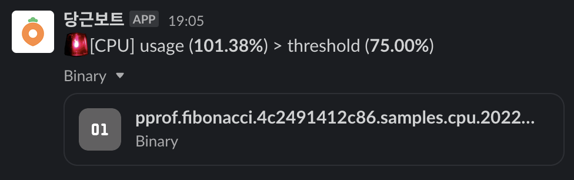
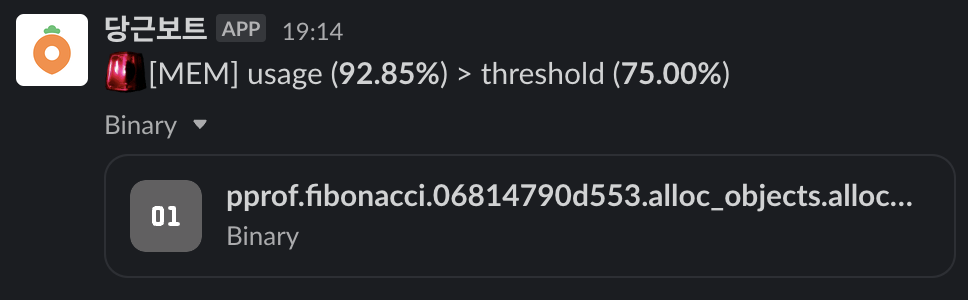

# autopprof

 [](https://github.com/daangn/autopprof/releases)

Automatically profile the Go applications when CPU or memory utilization crosses specific
threshold levels against the Linux container CPU quota and memory limit.

Once you start the autopprof, the autopprof process will periodically check the CPU and
memory utilization of the Go applications. If the resource utilization crosses the
specified threshold for each type of resource, the autopprof will automatically profile
the application (heap or cpu) and report the profiling report to the specific reporter (
e.g. Slack).

| CPU Profile Report Example                                 | Memory Profile Report Example                              |
|------------------------------------------------------------|------------------------------------------------------------|
|  |  |

## Installation

```bash
go get -u github.com/daangn/autopprof
```

## Usage

> If your application is running on non-linux systems, you should check the
> ErrUnsupportedPlatform error returned from `autopprof.Start()` and handle it properly.

```go
package main

import (
	"errors"
	"log"

	"github.com/daangn/autopprof"
	"github.com/daangn/autopprof/report"
)

func main() {
	err := autopprof.Start(autopprof.Option{
		CPUThreshold: 0.8, // Default: 0.75.
		MemThreshold: 0.8, // Default: 0.75.
		Reporter: report.NewSlackReporter(
			&report.SlackReporterOption{
				App:     "YOUR_APP_NAME",
				Token:   "YOUR_TOKEN_HERE",
				Channel: "#REPORT_CHANNEL",
			},
		),
	})
	if errors.Is(err, autopprof.ErrUnsupportedPlatform) {
		// You can just skip the autopprof.
		log.Println(err)
	} else if err != nil {
		log.Fatalln(err)
	}
	defer autopprof.Stop()

	// Your code here.
}
```

> You can create the custom reporter by implementing the `report.Reporter` interface.

## Benchmark

Benchmark the overhead of watching the CPU and memory utilization. The overhead is very
small, so we don't have to worry about the performance degradation.

> You can run the benchmark test with this command.
>
> ```bash
> ./benchmark.sh
> ```
>

```
BenchmarkLightJob-5                    	48688857	       244.4 ns/op	       0 B/op	       0 allocs/op
BenchmarkLightJobWithWatchCPUUsage-5   	48302185	       247.0 ns/op	       0 B/op	       0 allocs/op
BenchmarkLightJobWithWatchMemUsage-5   	47847954	       247.4 ns/op	       0 B/op	       0 allocs/op
BenchmarkHeavyJob-5                    	   57736	    205881 ns/op	       0 B/op	       0 allocs/op
BenchmarkHeavyJobWithWatchCPUUsage-5   	   58207	    208704 ns/op	       2 B/op	       0 allocs/op
BenchmarkHeavyJobWithWatchMemUsage-5   	   56606	    206473 ns/op	       2 B/op	       0 allocs/op
```

## License

[Apache 2.0](LICENSE)
