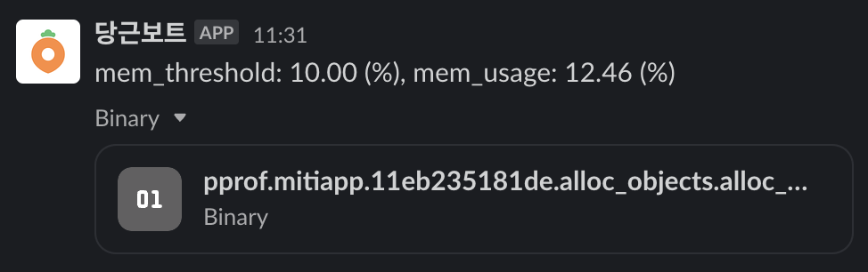

# autopprof

Automatically profile the Go applications when CPU or memory utilization crosses
threshold levels.

Once you start the autopprof, the autopprof process will periodically check the CPU and
memory utilization of the Go
applications. If the utilization crosses the specified threshold levels for each type of
resource,
it will automatically profile the application (heap or cpu) and report the profiling
results to the specific reporter (e.g. Slack).



> Currently, only Memory profiling is supported. We'll add CPU profiling support soon.
>
> And currently, only Slack reporter is supported. If you want to use other reporters,
> please send a pull request.

## Installation

```bash
go get -u github.com/daangn/autopprof
```

## Usage

> If your application is running on non-linux system, you should check the
> ErrUnsupportedPlatform error returned from `autopprof.Start()` and handle it properly.

```go
package main

import (
	"errors"
	"log"

	"github.com/daangn/autopprof"
	"github.com/daangn/autopprof/report"
)

func main() {
	err := autopprof.Start(autopprof.Option{
		App:          "YOUR_APP_NAME",
		MemThreshold: 0.8, // Default: 0.75.
		Reporter: report.ReporterOption{
			Type: report.SLACK,
			SlackReporterOption: &report.SlackReporterOption{
				Token:   "YOUR_TOKEN_HERE",
				Channel: "#REPORT_CHANNEL",
			},
		},
	})
	if errors.Is(err, autopprof.ErrUnsupportedPlatform) {
		// You can just skip the autopprof.
		log.Println(err)
	} else if err != nil {
		log.Fatalln(err)
	}
	defer autopprof.Stop()

	// Your code here.
}
```

## License

[Apache 2.0](LICENSE)
