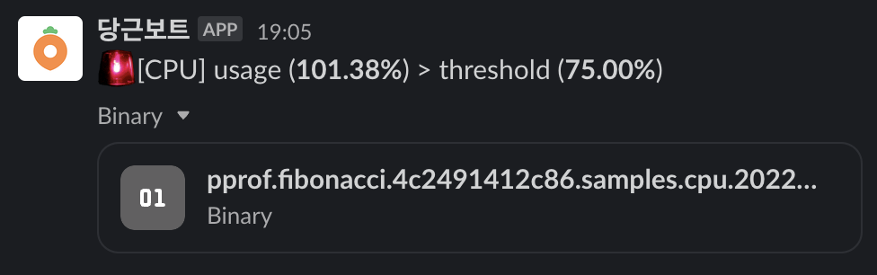
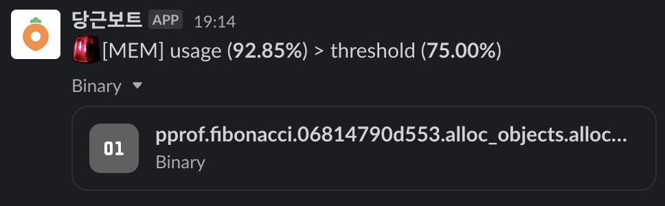

# autopprof

 [](https://github.com/daangn/autopprof/releases)

Automatically profile the Go applications when CPU or memory utilization crosses specific
threshold levels against the Linux container CPU quota and memory limit.

Once you start the autopprof, the autopprof process will periodically check the CPU and
memory utilization of the Go applications. If the resource utilization crosses the
specified threshold for each type of resource, the autopprof will automatically profile
the application (heap or cpu) and report the profiling report to the specific reporter (
e.g. Slack).

| CPU Profile Report Example                                 | Memory Profile Report Example                              |
|------------------------------------------------------------|------------------------------------------------------------|
|  |  |

## Installation

```bash
go get -u github.com/daangn/autopprof/v2
```

## Usage

> If your application is running on non-linux systems, you should check the
> ErrUnsupportedPlatform error returned from `autopprof.Start()` and handle it properly.

```go
package main

import (
	"errors"
	"log"

	"github.com/daangn/autopprof/v2"
	"github.com/daangn/autopprof/v2/report"
)

func main() {
	err := autopprof.Start(autopprof.Option{
		App:          "YOUR_APP_NAME",
		CPUThreshold: 0.8, // Default: 0.75.
		MemThreshold: 0.8, // Default: 0.75.
		Reporter: report.NewSlackReporter(
			&report.SlackReporterOption{
				Token:     "YOUR_TOKEN_HERE",
				ChannelID: "REPORT_CHANNEL_ID",
			},
		),
	})
	if errors.Is(err, autopprof.ErrUnsupportedPlatform) {
		// You can just skip the autopprof.
		log.Println(err)
	} else if err != nil {
		log.Fatalln(err)
	}
	defer autopprof.Stop()

	// Your code here.
}
```

> You can create a custom reporter by implementing the `report.Reporter` interface.

## Custom metrics

Beyond the built-in CPU / memory / goroutine watchers, you can register your own
`Metric` — useful for domain signals that only the owning struct knows about
(connection-pool usage, queue backlog, cache hit ratio, …).

```go
type Pool struct { /* ... */ }

func (p *Pool) Name() string            { return "db_pool" }
func (p *Pool) Threshold() float64      { return 0.9 }
func (p *Pool) Interval() time.Duration { return 10 * time.Second } // 0 → global watchInterval
func (p *Pool) Query() (float64, error) { return p.Usage(), nil }
func (p *Pool) Collect(v float64) (autopprof.CollectResult, error) {
    snap, err := p.Snapshot()
    if err != nil {
        return autopprof.CollectResult{}, err
    }
    return autopprof.CollectResult{
        Reader:   bytes.NewReader(snap),
        Filename: fmt.Sprintf("db_pool_%d.dump", time.Now().Unix()),
        Comment:  fmt.Sprintf(":rotating_light:[pool] %.2f ≥ 0.90", v),
    }, nil
}

// After autopprof.Start(...) — typically inside the struct's constructor:
_ = autopprof.Register(pool)
defer autopprof.Unregister("db_pool")
```

For one-off hooks you can skip the custom type entirely:

```go
_ = autopprof.Register(autopprof.NewMetric(
    "goroutine_blocked", 100, 5*time.Second,
    func() (float64, error)                        { return float64(runtime.NumGoroutine()), nil },
    func(v float64) (autopprof.CollectResult, error) { /* ... */ },
))
```

The names `cpu`, `mem`, and `goroutine` are reserved for the built-in metrics.
User metrics do **not** participate in the built-in cascade.

A built-in breach reports every other enabled built-in in addition to the
triggering one. Set `DisableCPUProf`, `DisableMemProf`, or
`DisableGoroutineProf` to opt a built-in out — it leaves the watcher and
the cascade in one step.

## Migrating from v1 to v2

v2 unifies CPU / Mem / Goroutine / Custom under a single `Metric` interface
and narrows the `Reporter` surface. This section lists every change a v1
caller needs to make.

### 1. Update the module path

```diff
- import "github.com/daangn/autopprof"
+ import "github.com/daangn/autopprof/v2"
```

Update `go.mod`:

```bash
go get github.com/daangn/autopprof/v2
```

### 2. `Option` changes

| v1 | v2 |
|---|---|
| `ReportBoth bool` | **Removed.** Cascade is always on for enabled built-ins. |
| `ReportAll bool`  | **Removed.** Cascade is always on for enabled built-ins. |
| *(n/a)* | `App string` — the `"<app>"` segment of built-in filenames. Defaults to `"autopprof"` when empty. |
| *(n/a)* | `Metrics []Metric` — user-defined metrics to register at `Start`. |

All other fields (`CPUThreshold`, `MemThreshold`, `GoroutineThreshold`,
`Disable*Prof`, `Reporter`) are unchanged. Disable individual built-ins
via `Disable*Prof` — they're excluded from the cascade as well.

```diff
 autopprof.Start(autopprof.Option{
+    App:          "YOUR_APP_NAME",
     CPUThreshold: 0.8,
-    ReportBoth:   true,
     Reporter:     myReporter,
 })
```

### 3. `SlackReporterOption` changes

```diff
 report.NewSlackReporter(&report.SlackReporterOption{
-    App:       "YOUR_APP_NAME",   // moved to Option.App
     Token:     "YOUR_TOKEN_HERE",
-    Channel:   "old-channel-name", // removed; Slack API dropped channel-name uploads
     ChannelID: "REPORT_CHANNEL_ID",
 })
```

### 4. `Reporter` interface (4 methods → 1)

```diff
-type Reporter interface {
-    ReportCPUProfile(ctx context.Context, r io.Reader, ci CPUInfo) error
-    ReportHeapProfile(ctx context.Context, r io.Reader, mi MemInfo) error
-    ReportGoroutineProfile(ctx context.Context, r io.Reader, gi GoroutineInfo) error
-}
+type Reporter interface {
+    Report(ctx context.Context, r io.Reader, info ReportInfo) error
+}
+
+type ReportInfo struct {
+    MetricName string  // "cpu", "mem", "goroutine", or user-defined name
+    Filename   string
+    Comment    string
+    Value      float64
+    Threshold  float64
+}
```

Custom `Reporter` implementations should route on `info.MetricName`:

```go
func (r *MyReporter) Report(ctx context.Context, reader io.Reader, info report.ReportInfo) error {
    switch info.MetricName {
    case "cpu":
        return r.sendCPU(ctx, reader, info.Value*100, info.Threshold*100)
    case "mem":
        return r.sendMem(ctx, reader, info.Value*100, info.Threshold*100)
    case "goroutine":
        return r.sendGoroutine(ctx, reader, int(info.Value), int(info.Threshold))
    default:
        return r.sendCustom(ctx, reader, info)
    }
}
```

Removed types from the `report` package: `CPUInfo`, `MemInfo`, `GoroutineInfo`,
`CPUProfileFilenameFmt`, `HeapProfileFilenameFmt`, `GoroutineProfileFilenameFmt`.

### 5. Bug fixes carried in v2

- `Option.DisableGoroutineProf` was silently ignored in v1 (the value
  wasn't assigned to the internal struct at `Start` time). It now takes
  effect correctly, which may change observed behavior for callers
  relying on the flag.
- Cascade (the v1 `ReportAll: true` behavior) is now unconditional for
  enabled built-ins; use `Disable*Prof` to opt specific metrics out.

### 6. New: custom metrics

v2 lets you register your own `Metric`. See the **Custom metrics** section
above — this is the main reason to migrate.

## Benchmark

Benchmark the overhead of watching the CPU and memory utilization. The overhead is very
small, so we don't have to worry about the performance degradation.

> You can run the benchmark test with this command.
>
> ```bash
> ./benchmark.sh
> ```
>

```
BenchmarkLightJob-12                                	98078731	       134.5 ns/op	       0 B/op	       0 allocs/op
BenchmarkLightJobWithWatchCPUUsage-12               	92799849	       133.0 ns/op	       0 B/op	       0 allocs/op
BenchmarkLightJobWithWatchMemUsage-12               	96778594	       128.3 ns/op	       0 B/op	       0 allocs/op
BenchmarkHeavyJob-12                                	  105848	    106606 ns/op	       0 B/op	       0 allocs/op
BenchmarkHeavyJobWithWatchCPUUsage-12               	  113047	    112734 ns/op	       1 B/op	       0 allocs/op
BenchmarkHeavyJobWithWatchMemUsage-12               	  101102	    133426 ns/op	       1 B/op	       0 allocs/op
BenchmarkLightAsyncJob-12                           	  399696	     29953 ns/op	    7040 B/op	     352 allocs/op
BenchmarkLightAsyncJobWithWatchGoroutineCount-12    	  347266	     34259 ns/op	    7040 B/op	     352 allocs/op
BenchmarkHeavyAsyncJob-12                           	     452	  26689023 ns/op	 6002064 B/op	  300097 allocs/op
BenchmarkHeavyAsyncJobWithWatchGoroutineCount-12    	     414	  27350318 ns/op	 5973015 B/op	  298647 allocs/op
```

## License

[Apache 2.0](LICENSE)
